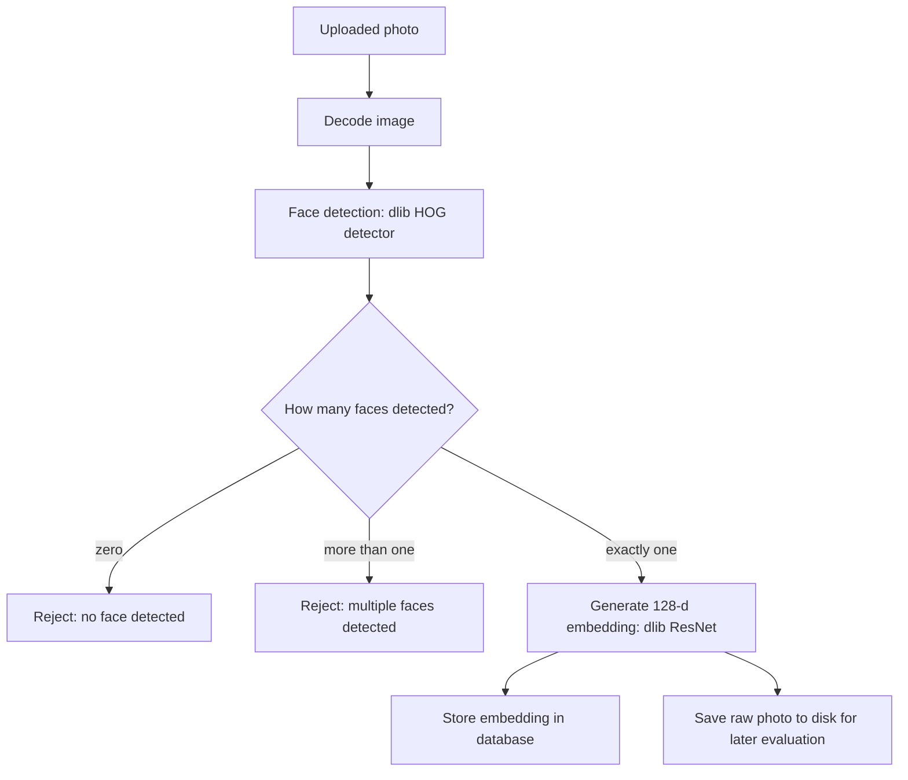
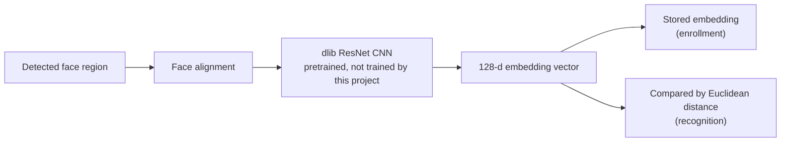
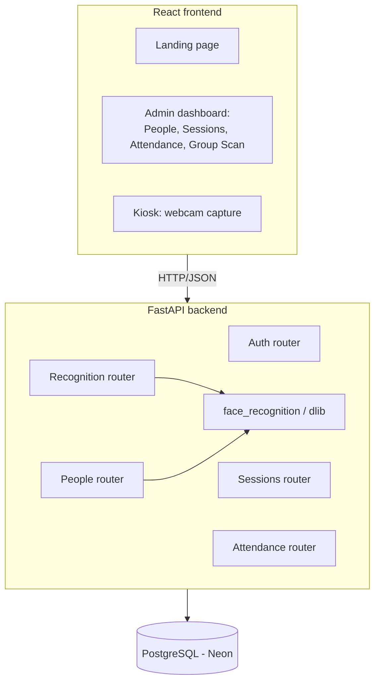
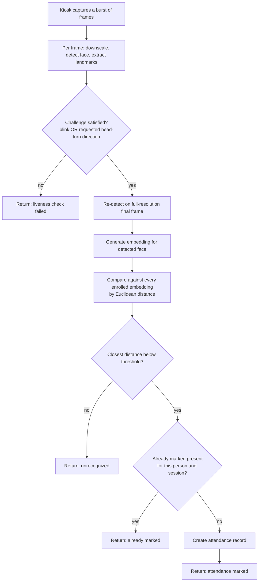
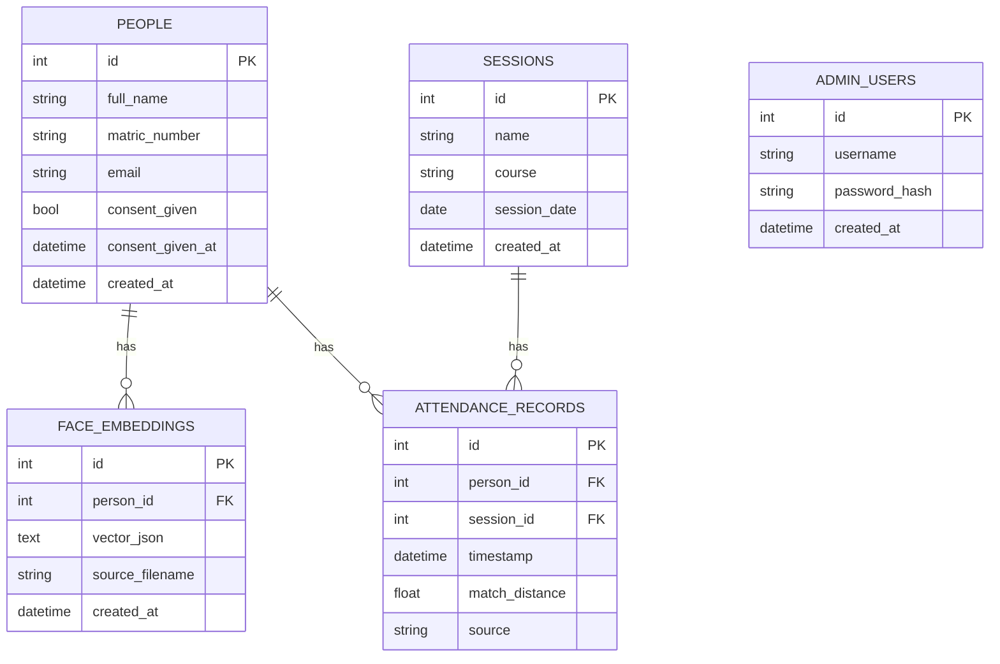

# CHAPTER THREE

# METHODOLOGY AND SYSTEM DESIGN

## 3.1 Research Design

This study followed a design-and-evaluate approach rather than a purely theoretical one. The system was first designed and implemented in full, then tested under realistic conditions with real participants, and only then evaluated using the metrics described later in this chapter. This ordering matters methodologically: the enrollment cohort, the operating threshold, and the specific defects reported in the results chapter were all discovered through building and testing the system, not assumed in advance of building it.

## 3.2 Dataset and Enrollment Description

The enrolled dataset consists of the project researchers together with consenting classmates. Before any photograph was captured, each participant was shown a written consent form describing what data would be collected (reference photographs and the face embeddings derived from them), how it would be stored (locally and in a private, access-controlled database, never in the project's public source code repository), and their right to withdraw at any time, and each participant's consent was recorded with a timestamp before their enrollment record was created. Enrollment requires between five and eight reference photographs per participant, captured under normal, uncontrolled indoor lighting rather than a studio setup, since the system is intended to work under the same conditions it will actually be used in.

## 3.3 Preprocessing Pipeline

Every uploaded enrollment photograph passes through the same preprocessing pipeline before it is either accepted or rejected. The image is decoded, passed through a face detector, and accepted only if the detector finds exactly one face; a photograph with no detectable face or with more than one detected face is rejected immediately, with the specific reason shown back to the person enrolling so the photograph can be retaken.

*Figure 3.1: Enrollment preprocessing pipeline.*

The same detection step, without the enrollment-specific one-face rule, is reused during recognition: a live capture is allowed to contain more than one face only in the group-scan (administrator) mode, since a kiosk capture is expected to show one person at a time.

## 3.4 Model and Embedding Architecture

Face detection and embedding generation are both provided by the `face_recognition` Python library, which wraps a pretrained dlib model rather than a model built or trained for this project. Detection uses a Histogram of Oriented Gradients (HOG) based detector. Embedding generation uses a dlib ResNet-based convolutional neural network, pretrained on a large face dataset, which maps an aligned face image to a 128-dimensional embedding vector.

*Figure 3.2: Embedding generation architecture.*

Recognition and enrollment share this exact architecture; the only difference between them is what happens to the resulting embedding afterward, either it is stored, during enrollment, or it is compared against every already-stored embedding, during recognition.

## 3.5 Training and Fine-Tuning Approach

No model in this system was trained or fine-tuned by this project. The dlib ResNet encoder is used exactly as pretrained and distributed with the `face_recognition` library. This was a deliberate design decision rather than a limitation discovered after the fact: training a face recognition network from scratch requires a very large labeled face dataset and substantial compute, neither of which is realistic to acquire and use correctly within a final year project's timeframe, and attempting to do so would have left little time for the system integration, liveness detection, and honest evaluation that this study also required. Instead, this project's contribution lies in how a proven, pretrained encoder is integrated into a complete, consent-based, liveness-checked attendance workflow and evaluated, not in the encoder itself.

## 3.6 System Architecture

The system is split into a React frontend and a FastAPI backend, communicating over HTTP, with a PostgreSQL database (hosted on Neon) as the single source of truth for enrolled people, embeddings, sessions, and attendance records.

*Figure 3.3: System architecture.*

The admin-facing routes (people, sessions, attendance review, group scan) require an authenticated admin session using a JSON Web Token. The kiosk-facing recognition routes are deliberately left unauthenticated, on the basis that a walk-up attendance kiosk is used by students who do not have, and should not need, an admin login; its security model relies on physical access to the kiosk device rather than a login.

### 3.6.1 Recognition and Attendance-Logging Flowchart

*Figure 3.4: Recognition and attendance-logging flowchart.*

## 3.7 Database Design

*Figure 3.5: Entity-relationship diagram.*

A person can have many stored embeddings, one per accepted enrollment photograph, rather than a single averaged embedding, so that recognition compares a query against every individual sample rather than one blended representation. A unique constraint on the pairing of person and session in the attendance records table enforces, at the database level rather than only in application code, that a person can be marked present at most once per session.

## 3.8 Evaluation Metrics

Evaluation is based on pairwise comparisons between face embeddings. A genuine pair is two photographs of the same enrolled person; an impostor pair is two photographs of different people, including comparisons between two different enrolled people and, where available, comparisons between an enrolled person and someone never enrolled at all. Given a chosen distance threshold, a pair is treated as a predicted match if its distance is below the threshold. From this, four counts are defined: true positives (TP), genuine pairs correctly predicted as a match; false negatives (FN), genuine pairs incorrectly predicted as not a match; false positives (FP), impostor pairs incorrectly predicted as a match; and true negatives (TN), impostor pairs correctly predicted as not a match.

Accuracy = (TP + TN) / (TP + TN + FP + FN)

Precision = TP / (TP + FP)

Recall = TP / (TP + FN)

F1-score = 2 x (Precision x Recall) / (Precision + Recall)

False Acceptance Rate (FAR) = FP / (FP + TN), the proportion of impostor pairs wrongly accepted as a match.

False Rejection Rate (FRR) = FN / (TP + FN), the proportion of genuine pairs wrongly rejected.

Equal Error Rate (EER) is the error rate at the specific threshold where FAR and FRR are equal, or as close to equal as the available thresholds allow; it summarizes overall separability at a single, threshold-independent operating point.

ROC-AUC is the area under the Receiver Operating Characteristic curve, which plots the true positive rate against the false positive rate as the decision threshold is varied continuously; unlike the other metrics above, it summarizes performance across every possible threshold rather than one chosen operating point.

These metrics are computed by a dedicated offline evaluation script rather than inside the live application, so that evaluation can be re-run against an updated enrolled dataset at any time without touching the production recognition code path.

## 3.9 Implementation Tools

- **Backend**: Python, FastAPI, SQLAlchemy (ORM), Alembic-compatible schema, Uvicorn.
- **Face detection and recognition**: dlib, the `face_recognition` Python library, OpenCV (used for image downscaling before detection).
- **Liveness detection**: dlib's 68-point facial landmark predictor, used to compute Eye Aspect Ratio for blink detection and, via OpenCV's `solvePnP`, an approximate head-pose yaw angle for head-turn detection.
- **Database**: PostgreSQL, hosted on Neon.
- **Frontend**: React, Vite, plain CSS.
- **Authentication**: JSON Web Tokens (`python-jose`), password hashing via `bcrypt`.
- **Evaluation**: `scikit-learn` (ROC curve and AUC computation), `matplotlib` (for evaluation plots), a custom offline evaluation script.
- **Testing**: `pytest`, FastAPI's `TestClient`.
- **Version control and environment**: Git, Python virtual environments, Node.js/npm for the frontend toolchain.
